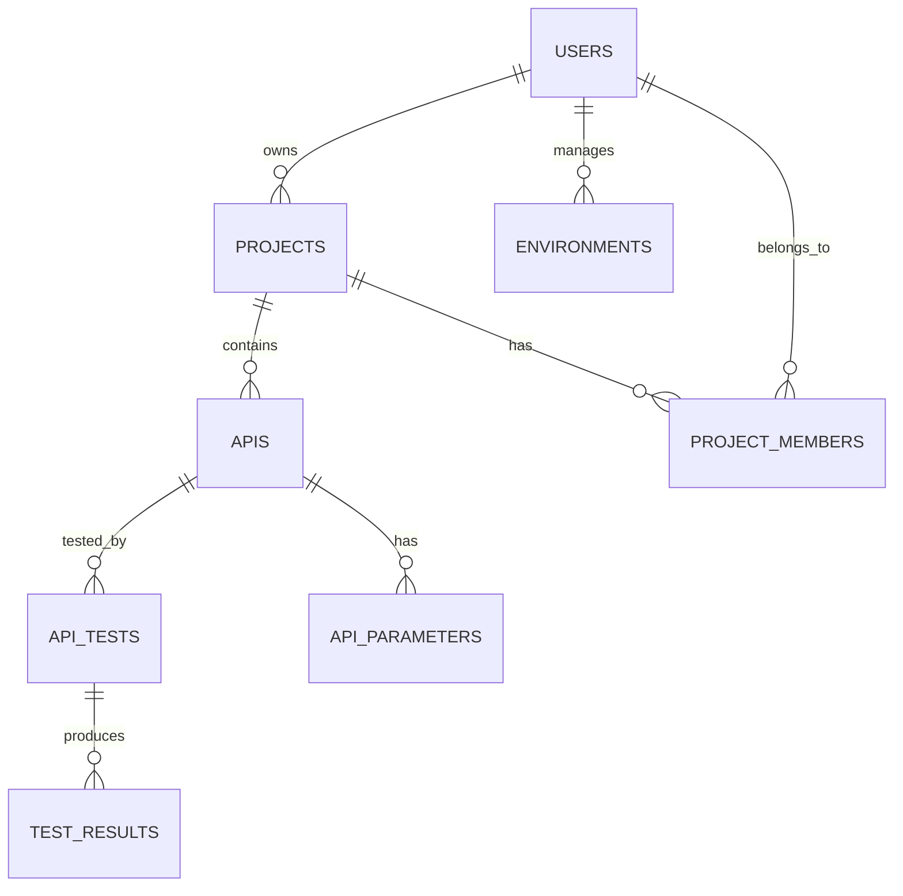

# API管理アプリ システム設計書

## 1. システムアーキテクチャ

### 1.1 全体構成
```
┌─────────────────┐    ┌─────────────────┐    ┌─────────────────┐
│   Frontend      │    │   Backend       │    │   Database      │
│   (React)       │◄──►│   (Node.js)     │◄──►│   (PostgreSQL)  │
│                 │    │                 │    │                 │
│ - UI Components │    │ - REST API      │    │ - User Data     │
│ - State Mgmt    │    │ - Authentication│    │ - API Data      │
│ - HTTP Client   │    │ - Business Logic│    │ - History Data  │
└─────────────────┘    └─────────────────┘    └─────────────────┘
                              │
                       ┌─────────────────┐
                       │   Cache         │
                       │   (Redis)       │
                       │                 │
                       │ - Session Data  │
                       │ - Temp Data     │
                       └─────────────────┘
```

### 1.2 技術スタック詳細

#### フロントエンド
- **フレームワーク**: React 18+ with TypeScript
- **ルーティング**: React Router v6
- **状態管理**: Zustand / Redux Toolkit
- **UIライブラリ**: Material-UI (MUI) / Chakra UI
- **HTTPクライアント**: Axios
- **フォーム**: React Hook Form + Zod
- **スタイリング**: Styled Components / Emotion

#### バックエンド
- **ランタイム**: Node.js 18+
- **フレームワーク**: Express.js
- **言語**: TypeScript
- **認証**: Passport.js + JWT
- **バリデーション**: Joi / Zod
- **ORM**: Prisma / TypeORM
- **APIドキュメント**: Swagger/OpenAPI

#### データベース
- **メインDB**: PostgreSQL 14+
- **キャッシュ**: Redis 7+
- **ファイルストレージ**: AWS S3 / Local Storage

## 2. データベース設計

### 2.1 ER図


### 2.2 テーブル定義

#### users テーブル
```sql
CREATE TABLE users (
    id SERIAL PRIMARY KEY,
    email VARCHAR(255) UNIQUE NOT NULL,
    password_hash VARCHAR(255) NOT NULL,
    name VARCHAR(100) NOT NULL,
    avatar_url VARCHAR(500),
    role VARCHAR(20) DEFAULT 'user',
    created_at TIMESTAMP DEFAULT CURRENT_TIMESTAMP,
    updated_at TIMESTAMP DEFAULT CURRENT_TIMESTAMP
);
```

#### projects テーブル
```sql
CREATE TABLE projects (
    id SERIAL PRIMARY KEY,
    name VARCHAR(100) NOT NULL,
    description TEXT,
    owner_id INTEGER REFERENCES users(id),
    is_public BOOLEAN DEFAULT false,
    created_at TIMESTAMP DEFAULT CURRENT_TIMESTAMP,
    updated_at TIMESTAMP DEFAULT CURRENT_TIMESTAMP
);
```

#### apis テーブル
```sql
CREATE TABLE apis (
    id SERIAL PRIMARY KEY,
    project_id INTEGER REFERENCES projects(id),
    name VARCHAR(100) NOT NULL,
    description TEXT,
    method VARCHAR(10) NOT NULL,
    endpoint VARCHAR(500) NOT NULL,
    base_url VARCHAR(255),
    tags TEXT[],
    status VARCHAR(20) DEFAULT 'active',
    created_at TIMESTAMP DEFAULT CURRENT_TIMESTAMP,
    updated_at TIMESTAMP DEFAULT CURRENT_TIMESTAMP
);
```

#### api_parameters テーブル
```sql
CREATE TABLE api_parameters (
    id SERIAL PRIMARY KEY,
    api_id INTEGER REFERENCES apis(id),
    name VARCHAR(100) NOT NULL,
    type VARCHAR(20) NOT NULL, -- 'query', 'path', 'body', 'header'
    data_type VARCHAR(20) NOT NULL, -- 'string', 'number', 'boolean', 'object'
    required BOOLEAN DEFAULT false,
    default_value TEXT,
    description TEXT,
    example TEXT
);
```

#### environments テーブル
```sql
CREATE TABLE environments (
    id SERIAL PRIMARY KEY,
    project_id INTEGER REFERENCES projects(id),
    name VARCHAR(50) NOT NULL,
    base_url VARCHAR(255) NOT NULL,
    headers JSONB,
    auth_config JSONB,
    is_default BOOLEAN DEFAULT false
);
```

#### api_tests テーブル
```sql
CREATE TABLE api_tests (
    id SERIAL PRIMARY KEY,
    api_id INTEGER REFERENCES apis(id),
    environment_id INTEGER REFERENCES environments(id),
    user_id INTEGER REFERENCES users(id),
    request_data JSONB NOT NULL,
    created_at TIMESTAMP DEFAULT CURRENT_TIMESTAMP
);
```

#### test_results テーブル
```sql
CREATE TABLE test_results (
    id SERIAL PRIMARY KEY,
    test_id INTEGER REFERENCES api_tests(id),
    status_code INTEGER,
    response_data JSONB,
    response_time INTEGER, -- milliseconds
    error_message TEXT,
    executed_at TIMESTAMP DEFAULT CURRENT_TIMESTAMP
);
```

## 3. API設計

### 3.1 RESTful API エンドポイント

#### 認証関連
```
POST   /api/auth/register     # ユーザー登録
POST   /api/auth/login        # ログイン
POST   /api/auth/logout       # ログアウト
GET    /api/auth/me           # 現在のユーザー情報
```

#### プロジェクト関連
```
GET    /api/projects          # プロジェクト一覧
POST   /api/projects          # プロジェクト作成
GET    /api/projects/:id      # プロジェクト詳細
PUT    /api/projects/:id      # プロジェクト更新
DELETE /api/projects/:id      # プロジェクト削除
```

#### API関連
```
GET    /api/projects/:projectId/apis     # API一覧
POST   /api/projects/:projectId/apis     # API作成
GET    /api/apis/:id                     # API詳細
PUT    /api/apis/:id                     # API更新
DELETE /api/apis/:id                     # API削除
```

#### テスト関連
```
POST   /api/apis/:id/test     # APIテスト実行
GET    /api/apis/:id/history  # テスト履歴
GET    /api/tests/:id         # テスト結果詳細
```

### 3.2 レスポンス形式

#### 成功レスポンス
```json
{
  "success": true,
  "data": {},
  "message": "Operation completed successfully"
}
```

#### エラーレスポンス
```json
{
  "success": false,
  "error": {
    "code": "VALIDATION_ERROR",
    "message": "Invalid input data",
    "details": []
  }
}
```

## 4. セキュリティ設計

### 4.1 認証・認可
- **JWT Token**: ヘッダーでのBearer認証
- **Token有効期限**: 24時間
- **Refresh Token**: 30日間有効
- **Role-based Access Control**: admin, user, viewer

### 4.2 データ保護
- **パスワード**: bcrypt でハッシュ化
- **機密データ**: AES-256 で暗号化
- **通信**: HTTPS必須
- **CORS**: 許可ドメインの制限

### 4.3 入力値検証
- **SQLインジェクション**: ORMでの予防
- **XSS**: DOMPurify での無害化
- **CSRF**: CSRFトークンの使用

## 5. パフォーマンス設計

### 5.1 キャッシュ戦略
- **Redis**: セッション、頻繁にアクセスされるデータ
- **ブラウザキャッシュ**: 静的リソース
- **CDN**: 画像、CSS、JavaScript

### 5.2 データベース最適化
- **インデックス**: 検索クエリの高速化
- **ページネーション**: 大量データの分割読み込み
- **コネクションプール**: DB接続の効率化

## 6. モニタリング・ログ

### 6.1 アプリケーションログ
- **レベル**: ERROR, WARN, INFO, DEBUG
- **構造化ログ**: JSON形式
- **ローテーション**: 日次

### 6.2 メトリクス監視
- **レスポンス時間**: 平均、P95、P99
- **エラー率**: 4xx、5xxエラーの監視
- **リソース使用率**: CPU、メモリ、ディスク

## 7. デプロイ戦略

### 7.1 環境構成
- **開発環境**: ローカル Docker
- **ステージング環境**: AWS/GCP
- **本番環境**: AWS/GCP

### 7.2 CI/CD パイプライン
```
Git Push → Build → Test → Deploy to Staging → Deploy to Production
```

### 7.3 Docker構成
```dockerfile
# Multi-stage build for production optimization
FROM node:18-alpine AS builder
# ... build steps

FROM node:18-alpine AS production
# ... production setup
```
